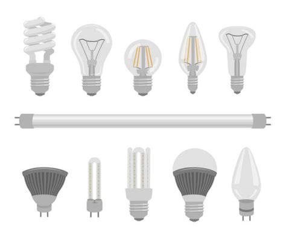

## You are asked in a coding interview... What is a design pattern. How do you answer this?

Imagine you are at a store looking for lightbulbs. They come in all different shapes and sizes, all with different functions. While searching for the right ones for your room, you implicitly know that each item you look at uses electricity to brighten a room without having to analyze them. You can categorize all of these items as "lightbulbs".

As simple as that may seem, that is the essence of design patterns: A design pattern is a reusable solution to a common problem. It is not code, but a proven approach that helps developers make better decisions. In this case, the problem is choosing which lightbulb to buy. Using design patterns, I know what type of light bulb I need to narrow down the options.

### Going deeper...

What type of design patterns are seen in programming? Here are a few types of design patterns:

- **Factory functions**  
  - Instead of sending all the information of a created object, parts of it can be sent using **factory functions**. These help create objects without having complex construction logic; you ask for an object, the factory gives you one that fits your needs.
  - *e.g. when wanting to compare prices of lightbulbs, a factory function can send only the required information to find the cheapest ones*

- **Singleton** 
  - When designing a class, only one instance of that class can be made so that multiple instances of the same class do not have to be made. This is done to make sure there is only a single shared instance, which keeps data consistent and avoids unnecessary duplication.
  - *e.g. If wanting to buy more than one lightbulb, the total price of all the lightbulbs you plan to buy can be kept track of instead of each individual price*

- **Observer** 
  - If you want to have a reaction happen as a result of an action, observers can be used to react to said change. Instead of having to constantly check all the time, an observer can react to a change.
  - *e.g. When purchasing a lightbulb, the store notes down this purchase and a receipt can be printed using a checkout desk.*

---

## What is an example of this used in a project?
In our software engineering course, my team designed an online marketplace where students could sell unwanted items to other students. Throughout this project, we used several design patterns:
- Singleton was used for our database connection. We only needed a single shared connection to fetch and update listings. This ensured consistent data and prevented unnecessary duplication.
- Factory functions were used to format listings coming from the database. Instead of returning raw SQL rows, a factory converted them into clean objects that our pages could display.
- Observer pattern appeared in our notification system. When a listing was updated or sold, observers triggered:
  - email notifications,
  - UI updates,
  - logging.

These patterns helped us organize the code, avoid rewriting logic, and make our system easier to maintain.

---

## Conclusion

Design patterns do not guarantee perfect software, just as buying the correct lightbulb does not guarantee the room will be perfectly lit. However, patterns give us a vocabulary, a structure, and a set of proven solutions. They help us communicate ideas quickly, avoid common mistakes, and focus on building features that matter. When a coding interview asks, “What is a design pattern?”, it is not a trick question. It is simply asking whether you can recognize the problem and can choose the right lightbulb for the job.