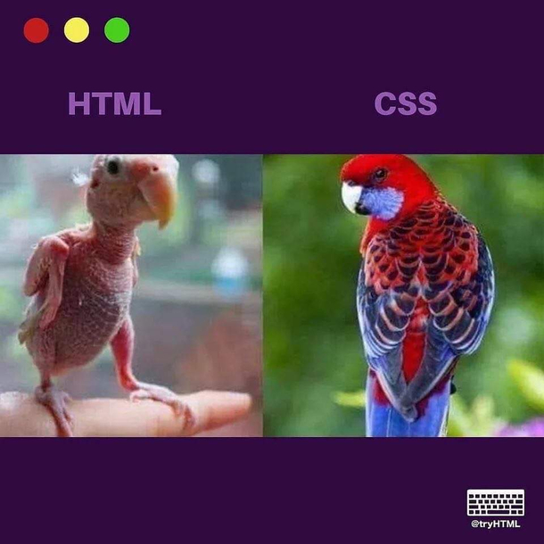

## A Canvas for Your Imagination! (Sort of...)

Today marks the day I finally took the leap to learn **HTML**, the foundational language used for structuring websites. Virtually everything on the web uses HTML from Google to Reddit to even this page you’re reading now!

With such ubiquity, there’s bound to be plenty of support and customization within the base HTML language... right?

However, there are some issues with using plain HTML:
- It’s not easy to add colors or images without using lots of inline `style=""` attributes.  
- Formatting text or changing fonts also requires excessive styling.
- Margins and padding (the blank space around objects) are nearly non-existent by default.  
- There’s no built-in way for HTML to create flexible layouts.  
- And much more!

---

## Now Add in a Little Bit of... SPICE! (CSS & Bootstrap)

This is where **CSS** and **Bootstrap** come to the rescue!  
CSS allows web developers to style their websites using reusable classes, while Bootstrap provides a large collection of prebuilt classes, components, and icons that help bring your site to life with color and structure.

---

## What Are the Limitations of HTML, CSS, and Bootstrap?

HTML is fundamentally a **markup language** - it’s great for defining the structure of a document, but not for performing computations or creating dynamic behavior.  
Similarly, CSS and Bootstrap handle styling and layout, but can’t perform logic or respond interactively to user input on their own.

Later on, we’ll learn **React** and **Next.js**, which will allow us to build interactive and dynamic web applications!

---

Below is an example of a mock website I created using Bootstrap:

