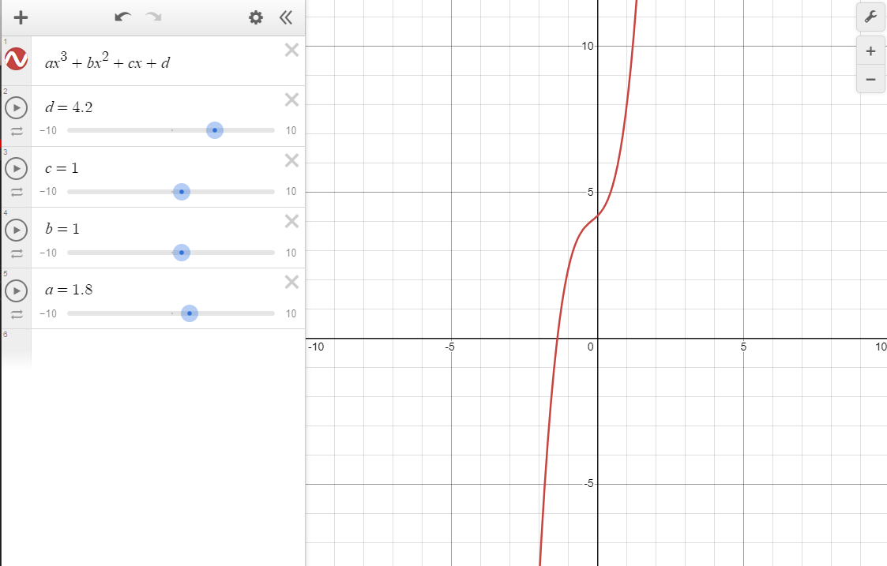

This program was coded when I first started learning the C language (or any coding language).  It is a rudementry program that finds the root(s) of a polynomial function.  This was my first ever coding project and it is reflected with my comments.  I feel if I were to code this now, it would be more clean and consise with more comments explaining certain processes.  Reflecting on now from when I first started, there have been a massive improvemnent in my overall capability to code.  

The code is listed below:

Source: <a href="https://github.com/oomorijosh/PolynomialFunctionSolution/"><i class="large github icon "></i>oomorijosh/PolynomialFunctionSolution</a>
