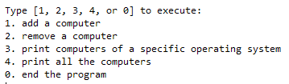

This demonstration reflects my current capabilities that I have in Java. It is a simulated "computer store" where you can add, remove, or view computers in a list.  A computer is defined by its barcode, OS, price, and model.  With these, any computer can be saved into the program as long as it has the 4 characteristics as mentioned above.  It is also checked so that it is not prone to crashing.  This was a solo project that took ~10 hours.

Source: <a href="https://github.com/oomorijosh/LinkedListComputerStore"><i class="large github icon "></i>oomorijosh/LinkedListComputerStore</a>
