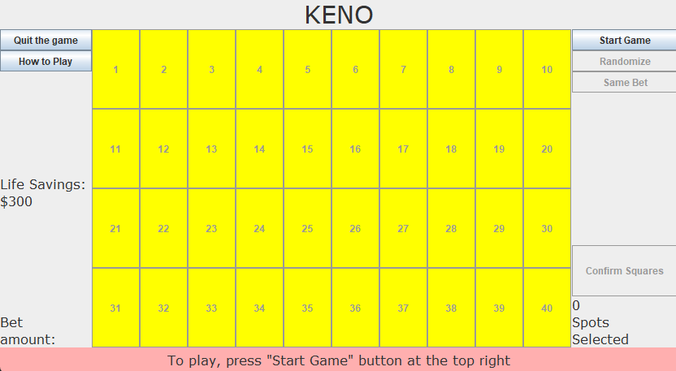

This game reflects my current capabilities that I have in Java. It is a game where the goal is to choose numbers you think that will be chosen.  THe more numbers you chose that matches up with the chosen spots, the more you win.  This code was self made for a project that involves user interfaces using JFrame and action listeners.  It comes with a set of instructions, a betting system, a randomize button option, outputs results to a text file, and a interface that works properly.

Source: <a href="https://github.com/oomorijosh/Keno-Game"><i class="large github icon "></i>oomorijosh/KenoGame</a>
