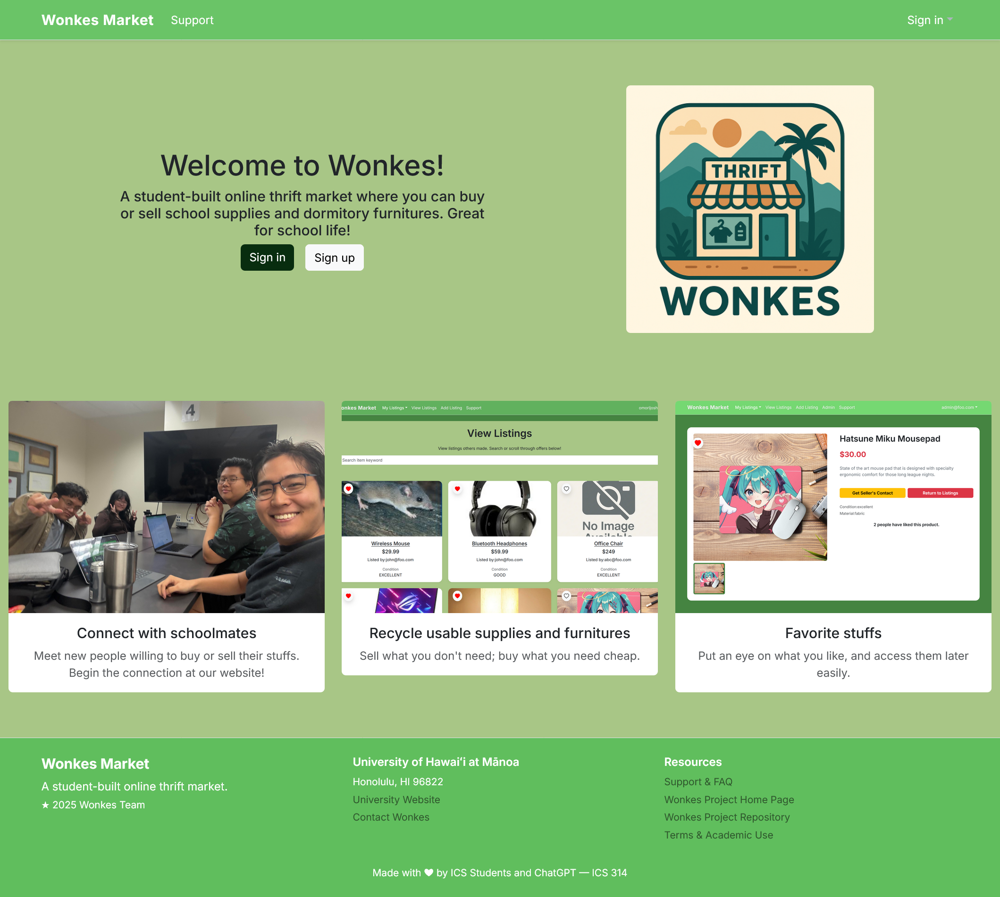

## The creation of the team...
Going into our Software Engineering final project, my expectations were admittedly low. Our task was to work in a team to create a fully functioning website within 4½ weeks, using the cumulative knowledge from our Software Engineering course. The problem was that most classmates had already formed groups, and I was left to find a team late in the process.

Eventually, I was placed with four other students whom I did not know well. As a result, our group felt like the “runt of the litter,” and I was unsure whether we would be able to complete such a large and complex project. Naturally, I was worried: would we actually be able to pull it off?

Our first meeting was a bit awkward, as expected. I tried to keep things lighthearted and positive, but internally I was concerned about the team’s direction. Since I wanted the project to succeed, I volunteered to take on a leadership role. We met over Discord, established communication norms, and created the team name **Wonkes**, formed from our last-name initials (and because it sounded funny). After outlining a plan and dividing responsibilities, my confidence in the team began to grow.

---

## What is Wonkes Manoa?
Wonkes Manoa is an online marketplace designed specifically for UH Mānoa students. The goal was to create a platform where students could quickly buy and sell campus-related items in a simple and accessible way.

To accomplish this, the project uses:
- **TypeScript**
- **UI Frameworks** (HTML/CSS, Bootstrap, React, and Next.js)
- **Databases** (PostgreSQL, Prisma, and Vercel)

Together, these technologies allowed us to build a modern, full-stack web application that meets the course requirements.

> For more information on Software Engineering requirements, click [here](../essays/software-reflection.md)

---

## My Contributions to Wonkes
The project was divided into three milestones:
- **Milestone 1:**  
  Organized the GitHub repository, implemented the landing page and listings view, and helped coordinate team workflow and responsibilities.

- **Milestone 2:**  
  Designed and implemented the “like” functionality for listings, including modifying the database schema to add the `LikedMerch` table. I also focused on cleaning up UI and improving overall usability.

- **Milestone 3:**  
  Developed the admin panel, implemented pagination, and fixed a wide range of last-minute bugs found throughout the site.

Across all milestones, I also played a key role in team coordination and problem-solving.

---

## What I learned
This project taught me a great deal, both technically and in terms of teamwork. On the technical side, I learned how to work with API routes in Next.js, how Prisma integrates with Vercel, and when it is appropriate to separate server and client components. From a teamwork perspective, I gained a deeper appreciation for effort estimation, communication, and leadership. Although the website is not in a fully polished state (especially post January 14, 2026 when the website will be closed from Vercel), it is something that shows my growth as a software engineer.

Despite my initial doubts, I truly enjoyed working with this team. If given the chance to redo this project, I would still choose to work with the same group. The experience challenged me, taught me valuable lessons, and showed me how far I have come.

---

### Links
- <a href="https://wonkes.vercel.app/">Main Wonkes Website</a>
- <a href="https://wonkes-manoa.github.io/">GitHub.io Site</a>
